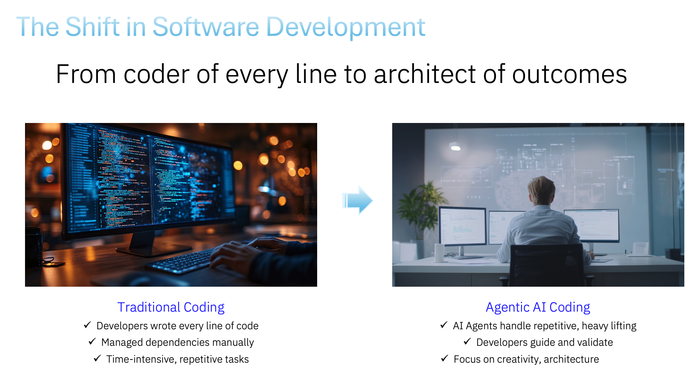

# Bob AI Workshop for High School Students
## From Design Thinking to Agentic AI - EDT Edition

### Workshop Overview
This workshop builds on Enterprise Design Thinking principles by showing students how agentic AI can rapidly transform their design concepts into working prototypes. Students will experience the complete cycle: from empathy and ideation (done in EDT session) to implementation and testing (with Bob). This hands-on workshop demonstrates how AI agents can be powerful partners in bringing human-centered designs to life.

**Duration:** 90 minutes

**Prerequisites:**

- Completion of EDT flower vase activity (previous day)
- Basic computer literacy
- Curiosity about AI

**Materials Needed:**

- Laptops with Bob access
- Internet connection
- Notes/sketches from EDT session (optional but helpful)

---

## Connection to Enterprise Design Thinking

Yesterday, you explored **Enterprise Design Thinking** and learned to reframe problems. You moved from "design a vase" to "create a better way to enjoy flowers" - shifting from object-focused to experience-focused thinking.

**Today, you'll see how AI can help implement those human-centered designs.**

### The Design-to-Implementation Cycle

**EDT Session (Yesterday):**

- 🎯 **Empathize** - Understand user needs
- 💡 **Ideate** - Reframe the challenge
- ✏️ **Sketch** - Visualize solutions
- 🗣️ **Playback** - Share and refine ideas

**Bob Workshop (Today):**

- 🤖 **Implement** - Turn ideas into working prototypes
- 🧪 **Test** - See your designs in action
- 🔄 **Iterate** - Refine based on results
- 🚀 **Scale** - Understand how AI accelerates development

---

## What is Agentic AI?

**Traditional AI Chatbots:**

- Answer questions
- Provide information
- Have conversations

**Agentic AI (like Bob):**

- Takes autonomous actions
- Uses tools to accomplish tasks
- Breaks down complex problems into steps
- Creates real, working prototypes
- Learns from results and adapts

**The Power of Human + AI:**

- **You bring:** Empathy, creativity, problem reframing, user understanding
- **Bob brings:** Technical implementation, rapid prototyping, iteration speed
- **Together:** Complete the design thinking cycle from concept to working solution

---

## Workshop Structure

### Part 1: Getting to Know Bob (10 minutes)

#### Quick Introduction to Bob's Capabilities

**Objective:** Understand what makes Bob different from regular chatbots



Bob isn't just conversational AI - Bob is an **agentic AI** that can:
- Create and modify files
- Build complete web applications
- Read and analyze existing code
- Make surgical improvements to projects
- Work step-by-step through complex tasks

**Quick Demo:** Watch the instructor ask Bob to explore the project directory and create a simple file.

**Key Concept:** Bob uses **tools** autonomously to accomplish goals. When you give Bob a task, Bob decides which tools to use and in what order.

**Discussion Points:**
- How is this different from ChatGPT or other AI you've used?
- What makes Bob "agentic"?
- How might this help with design thinking implementation?

---

### Part 2: From Design Thinking to Reality (20 minutes)

#### Getting Started: Launch Bob and Set Up Your Workspace

**Before we begin, let's get Bob ready to work!**

**Step 1: Launch Bob on Mac**

1. Open **Spotlight Search** by pressing `Cmd + Space`
2. Type "Bob" and press `Enter`
3. Wait for Bob to fully load - you'll see the Bob interface in the sidebar

**Step 2: Create Your Workspace Folder**

We'll create a dedicated folder for today's workshop projects:

1. In the left sidebar, click the **"Open Folder"** button
2. Navigate to where you want to create your workshop folder (e.g., Desktop or Documents)
3. Click the **"New Folder"** button
4. Name the folder with a meaningful name for your projects (e.g., `bob-workshop` or `my-projects`)
5. Select your new folder and click **"Open"**

**You're now ready to start building!** 🚀

---

#### Exercise 2.1: Reflecting on Your EDT Work
**Objective:** Bridge yesterday's design thinking to today's implementation

**Group Discussion (3 minutes):**

- What was your "better way to enjoy flowers" solution?
- What user need or experience were you trying to improve?
- What made your reframed solution better than just "a vase"?

**Common Reframed Solutions from EDT:**

- Digital flower journal or memory keeper
- Flower care reminder system
- Virtual garden or flower collection
- Flower-sharing or gifting platform
- Flower identification and learning tool
- Seasonal flower guide
- Flower arrangement inspiration tool
- Community flower exchange

---

#### Exercise 2.2: Bringing Your Design to Life with Bob
**Objective:** See Bob implement your design thinking solution

**The Challenge:** Choose one reframed "better way to enjoy flowers" concept and ask Bob to build a working prototype!

**Step 1: Choose Your Concept (2 minutes)**
Pick one idea from yesterday's EDT session - either your own or one from your team that you found compelling.

**Step 2: Translate Design Thinking to Bob Prompt (5 minutes)**

Think about:

- **User Experience:** What should users be able to do?
- **Core Features:** What are the 2-3 most important features?
- **Visual Design:** What mood or feeling should it convey?
- **Interactions:** What happens when users click or interact?

**Example Prompt Structure:**
```
Create a [name of solution] that helps people [user need/goal].

Features:
- [Feature 1]
- [Feature 2]
- [Feature 3]

Design: [mood/emotion] with [specific colors and style]
Interactions: [how users interact with it]

Save in folder: "flower-[concept-name]"
```

**Example Prompts Based on EDT Reframing:**

**Digital Flower Memory Journal:**
```
Create a flower memory journal to capture special moments with flowers.

Features:
- Add entries with flower type, date, occasion, and memory
- Display as cards with flower emojis
- Search and filter by flower type or occasion
- Export as keepsake

Design: Nostalgic feel with soft pastels and earth tones
Interactions: Simple form to add memories

Save in folder: "flower-memory-journal"
```

**Flower Care Companion:**
```
Create a flower care app to keep flowers alive longer.

Features:
- Track flowers with care schedules
- Reminders for watering and care tasks
- Care tips for different flower types
- Health status with visual indicators

Design: Helpful feel with fresh greens and florals
Interactions: Simple to add flowers and check tasks

Save in folder: "flower-care-companion"
```

**Virtual Flower Garden:**
```
Create a virtual garden to collect and arrange digital flowers.

Features:
- Choose flower types to add
- Arrange in different layouts
- Change seasons or backgrounds
- Save and share designs

Design: Playful and creative with vibrant, cheerful colors
Interactions: Drag-and-drop or click-to-add flowers

Save in folder: "virtual-flower-garden"
```

**Step 3: Watch Bob Work (8 minutes)**

Type your prompt you decided upon from above and watch Bob work:

**What to Observe:**

- How Bob breaks down the task into steps
- Which tools Bob uses (write_to_file, create folders, etc.)
- How Bob creates multiple files (HTML, CSS, JavaScript)
- How Bob explains what it's doing
- The working prototype that emerges!

**Step 4: Test and Discuss (2 minutes)**

Open the created projects in a browser and test them!

**Discussion Questions:**

- How close is the prototype to your original design thinking concept?
- What worked well in the prompt?
- What would you refine or add?
- How does this compare to sketching on paper?
- How fast was this compared to coding it yourself?

---

#### Key Insight: The Design Thinking + AI Partnership

**What You Did (EDT):**

- Empathized with users
- Reframed the problem
- Imagined better experiences
- Sketched solutions

**What Bob Did (Implementation):**

- Translated your vision into code
- Created working prototypes
- Made it interactive and functional
- Delivered in minutes, not days

**The Power:** Human creativity and empathy + AI implementation speed = Rapid innovation

---

### Part 3: Creative Projects (20 minutes)

#### Exercise 3.1: Build Something New
**Objective:** Apply design thinking principles to create an original project

**The Challenge:** Think of a problem or need in your life, reframe it (like you did with the vase), and ask Bob to build a solution!

**Design Thinking Process:**

**Step 1: Identify a Need (3 minutes)**

Think about:

- What frustrates you in daily life?
- What would make something easier or more enjoyable?
- What do you wish existed?

**Step 2: Reframe the Problem (2 minutes)**
Don't just think about the object or tool - think about the **experience** you want to create.

**Examples:**
- ❌ "I need a to-do list app"
- ✅ "I want to feel less overwhelmed and more accomplished"

- ❌ "I need a timer"
- ✅ "I want to stay focused and manage my time better"

- ❌ "I need a quiz app"
- ✅ "I want to make studying more engaging and fun"

**Step 3: Design Your Solution (5 minutes)**

Write a prompt that describes:

- The experience you want to create
- The key features that support that experience
- The mood and visual style
- How users will interact with it

**Step 4: Build with Bob (10 minutes)**
Give Bob your prompt and watch your design come to life!

**Project Ideas (Reframed for Experience):**

**Instead of "Study Tool" → "Confidence Builder"**

- Make studying feel like progress and achievement
- Celebrate small wins
- Track growth over time

**Instead of "Decision Maker" → "Clarity Creator"**

- Help reduce decision fatigue
- Make choices feel lighter and more fun
- Provide perspective when stuck

**Instead of "Mood Tracker" → "Self-Awareness Companion"**

- Help understand emotional patterns
- Encourage reflection
- Celebrate positive moments

**Instead of "Countdown Timer" → "Anticipation Amplifier"**

- Make waiting for events more exciting
- Build positive anticipation
- Share excitement with others

---

### Part 4: Code Analysis & Iteration (15 minutes)

#### Exercise 4.1: Understanding and Improving
**Objective:** See how Bob reads, analyzes, and improves existing code

**The Challenge:** Pick one of the projects created today and ask Bob to enhance it!

**Step 1: Code Review (5 minutes)**

Ask Bob to analyze the code:
```
Read the [project-name] files and:
1. Explain what the code does
2. Identify main components
3. Suggest 2-3 enhancements
```

**What to Observe:**

- Bob uses `read_file` to examine the code
- Bob explains technical concepts clearly
- Bob identifies improvement opportunities
- Bob thinks about user experience, not just code

**Step 2: Implement an Enhancement (10 minutes)**

Choose one enhancement and ask Bob to implement it:
```
Add [specific enhancement] to [project-name] that [describe behavior].
```

**Enhancement Ideas:**

- Add animations or transitions
- Include sound effects or music
- Add a new feature or interaction
- Improve the visual design
- Add data persistence (save user data)
- Include accessibility features
- Add responsive design for mobile

**What to Observe:**

- Bob uses `read_file` first to understand existing code
- Bob uses `apply_diff` to make surgical changes
- Bob preserves existing functionality
- Bob tests and explains the changes

**Discussion:**

- How did Bob know where to make changes?
- What makes a good enhancement vs. just adding features?
- How does iteration improve the design?

---

### Part 5: Wrap-Up & Reflection (25 minutes)

#### Group Share (20 minutes)

- 2-3 volunteers demo their projects
- Explain the problem they were solving
- Show how their solution creates a better experience
- Share what surprised them about working with Bob

#### Key Takeaways Discussion (5 minutes)

**The Design Thinking + AI Cycle:**

**Human Strengths:**

- Empathy and understanding user needs
- Creative problem reframing
- Defining meaningful experiences
- Evaluating and refining solutions

**AI Strengths:**

- Rapid prototyping and implementation
- Technical execution
- Iteration speed
- Handling complexity

**Together:**

- Complete the full design cycle faster
- Test ideas quickly
- Iterate based on real feedback
- Focus human creativity where it matters most

**Discussion Questions:**

**About Design Thinking:**

- How did reframing problems lead to better solutions?
- What's the difference between designing an object vs. designing an experience?
- How did your EDT work yesterday inform today's projects?

**About Agentic AI:**

- What impressed you most about Bob's capabilities?
- How is Bob different from other AI tools you've used?
- What are Bob's limitations?

**About the Partnership:**

- How does AI change the design process?
- What role should humans play vs. AI?
- How might this change how products are built in the future?

**About Ethics and Responsibility:**

- Who owns the designs Bob creates from your ideas?
- How should we give credit when using AI assistance?
- What should we be careful about with AI agents?
- How can we ensure AI serves human needs and values?

---


## Safety and Ethics Discussion

### Important Considerations

**AI Capabilities and Limitations:**

- Bob can make mistakes - always test and review
- Bob's knowledge has a cutoff date
- Bob can't understand context like humans do
- Bob follows instructions but doesn't have judgment

**Responsible AI Use:**

- Give credit when using AI assistance
- Understand what the code does (don't just use it blindly)
- Use AI to enhance learning, not replace it
- Consider privacy and data security
- Think about societal impact

**Design Ethics:**

- Design for real user needs, not just cool features
- Consider accessibility and inclusion
- Think about unintended consequences
- Respect user privacy and data
- Design responsibly and ethically

**Academic and Professional Integrity:**

- Using AI as a tool is different from claiming AI's work as your own
- Always follow your school's policies on AI use
- The goal is to learn and create, not just to get results
- Your creativity and judgment are irreplaceable

---

## Conclusion

Congratulations on completing the Design Thinking + Agentic AI Workshop! You've experienced the complete cycle from empathy and ideation to rapid prototyping and testing. You've seen how human creativity and AI implementation can work together to bring ideas to life faster than ever before.

**Key Takeaways:**

🎯 **Design Thinking Works:** Reframing problems leads to better solutions
🤖 **AI Accelerates:** Agentic AI can rapidly implement human-centered designs
🤝 **Partnership Matters:** Humans and AI each bring unique strengths
🔄 **Iteration is Key:** Quick prototyping enables faster learning and improvement
💡 **You're Empowered:** You can now turn ideas into working prototypes

**Remember:**

- Your empathy, creativity, and judgment are irreplaceable
- AI is a powerful tool that amplifies human capability
- The best solutions come from human-centered design + AI implementation
- Keep learning, iterating, and creating!

**The Future of Design:**
As AI tools become more capable, the ability to think like a designer - with empathy, creativity, and user focus - becomes even more valuable. You're learning skills that will serve you throughout your career, no matter what field you enter.

**Keep designing, keep building, keep making the world better!** 🚀

---

*Workshop created for IBM Bob - An Agentic AI Assistant*
*EDT Edition - Version 1.0*
*Designed for high school students who have completed Enterprise Design Thinking activities*
*Duration: 90 minutes*

