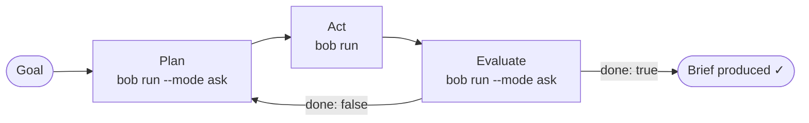

# Lab 6c (Optional): Build an Agentic Report Analysis App with Bob Shell

!!! info "This is an optional extension of Lab 6"
    Lab 6 introduced agentic AI concepts at a high level. This lab goes further —
    you use the `agent-with-bob-shell` skill to generate a **complete, runnable
    agentic application** from a single prompt, then explore and extend it.
    Skip this lab if you are short on time; come back to it as a self-paced exercise.

## Overview

In this lab you use IBM Bob Shell to **generate a complete Python application from a single prompt**. The application reads two monthly project status reports, compares them, and produces a structured follow-up brief — all through an agentic **Plan → Act → Evaluate** loop — and serves the whole experience through a browser UI.

You do not write any code yourself. You write a prompt, Bob builds the project, and you run it.

By the end you will understand the **Plan → Act → Evaluate** pattern hands-on and know how to use the `agent-with-bob-shell` skill to build agentic apps with Bob Shell as the reasoning engine.

**Who this is for:** Developers and technical practitioners who want to go deeper after Lab 6.

**Time needed:** 30–40 minutes

**Prerequisites:**

- Completion of Lab 6 (or familiarity with agentic AI concepts)
- Bob Shell installed (`bob --version` prints a version number — if not, see [Installing Bob Shell](https://bob.ibm.com/docs/shell/getting-started/install-and-setup))
- Bob Shell authenticated with an API key — see [Before You Start](#before-you-start-authenticate-bob-shell) below
- Python 3.9 or later (`python3 --version`)
- A terminal you are comfortable running commands in

---

## Before You Start: Authenticate Bob Shell

`bob run` requires a **BOB_API_KEY** environment variable. This is different from the interactive `bob chat` command, which can use browser-based SSO.

**Step 1 — Get your API key**

1. Go to the [Bob web portal](https://bob.ibm.com) and sign in with your IBMid
2. Navigate to **Account → API Keys** and create a new key with **Scope: Inference**
3. Copy the key value immediately — you cannot view it again after closing the dialog

**Step 2 — Set the environment variable**

=== "Mac / Linux"

    For this terminal session only:
    ```bash
    export BOB_API_KEY="your-api-key-here"
    ```

    To make it permanent, add it to your shell profile:
    ```bash
    echo 'export BOB_API_KEY="your-api-key-here"' >> ~/.zshrc   # or ~/.bashrc
    source ~/.zshrc
    ```

=== "Windows (PowerShell)"

    For this session only:
    ```powershell
    $env:BOB_API_KEY = "your-api-key-here"
    ```

    To make it permanent:
    ```powershell
    [System.Environment]::SetEnvironmentVariable("BOB_API_KEY","your-api-key-here","User")
    ```

!!! warning
    Never commit your API key to source control. Add `.env` to your `.gitignore` if you store the key in a file.

!!! note "General-scope API keys"
    If your key has scope **General** rather than **Inference**, you must also pass
    `--team-id <your-team-id>` on every `bob run` call. The Inference-scoped key
    is simpler for this lab — use that if you can.

**Step 3 — Verify**

```bash
bob run "Say hello in one sentence." --log-level silent
```

You should see a single sentence reply. If you see `Error: Bob API key is required`, check that `BOB_API_KEY` is set in the current terminal session (`echo $BOB_API_KEY`).

---

## How the App Works

The application Bob builds follows a three-phase agentic loop, with Bob Shell handling each phase as a subprocess:



| Phase | What happens | Bob Shell mode |
| :--- | :--- | :--- |
| **Plan** | Decides the single next concrete step — describes it, does not execute | `--mode ask` |
| **Act** | Carries out that step — reads both reports, writes the brief | *(default agent)* |
| **Evaluate** | Checks whether the brief meets all quality criteria | `--mode ask` |

Your Python script is the **orchestrator** — it drives the loop, manages state, and passes context between phases.  
Bob Shell is the **execution engine** — it reasons, uses file tools, and produces output.

The browser UI wraps this loop with a Flask server and Server-Sent Events (SSE) — each phase streams to the browser as it completes, with no polling required.

---

## Before You Start: Install the Skill

This lab uses the **`agent-with-bob-shell`** skill. Skills are instruction sets stored as files that Bob reads before acting — this one teaches Bob how to build agentic Python apps with the Plan→Act→Evaluate pattern.

The skill needs to be in a Bob skills directory **before** you run the prompt in Step 1. Choose the option that matches your situation.

---

### Option A — Clone the workshop repository (recommended)

Cloning gives you the skill, the slash command, and all lab materials in one step.

```bash
git clone https://github.com/IBM/intro-bob-workshop.git
cd intro-bob-workshop
```

The skill is at `.bob/skills/agent-with-bob-shell/` inside the cloned folder. Open Bob IDE from this directory and it will be picked up automatically.

---

### Option B — Download just the skill (no clone)

If you don't want to clone the whole repo, download only the skill folder into your global Bob skills directory:

=== "Mac / Linux"

    ```bash
    mkdir -p ~/.bob/skills/agent-with-bob-shell
    BASE="https://raw.githubusercontent.com/IBM/intro-bob-workshop/main/.bob/skills/agent-with-bob-shell"
    curl -sSL "$BASE/SKILL.md"    -o ~/.bob/skills/agent-with-bob-shell/SKILL.md
    curl -sSL "$BASE/EXAMPLES.md" -o ~/.bob/skills/agent-with-bob-shell/EXAMPLES.md
    mkdir -p ~/.bob/skills/agent-with-bob-shell/references
    curl -sSL "$BASE/references/CODE.md"             -o ~/.bob/skills/agent-with-bob-shell/references/CODE.md
    curl -sSL "$BASE/references/PROMPT_TEMPLATES.md" -o ~/.bob/skills/agent-with-bob-shell/references/PROMPT_TEMPLATES.md
    curl -sSL "$BASE/references/REFERENCE.md"        -o ~/.bob/skills/agent-with-bob-shell/references/REFERENCE.md
    ```

=== "Windows (PowerShell)"

    ```powershell
    $dest = "$env:USERPROFILE\.bob\skills\agent-with-bob-shell"
    $base = "https://raw.githubusercontent.com/IBM/intro-bob-workshop/main/.bob/skills/agent-with-bob-shell"
    New-Item -ItemType Directory -Force "$dest\references" | Out-Null
    Invoke-WebRequest "$base/SKILL.md"                        -OutFile "$dest\SKILL.md"
    Invoke-WebRequest "$base/EXAMPLES.md"                     -OutFile "$dest\EXAMPLES.md"
    Invoke-WebRequest "$base/references/CODE.md"              -OutFile "$dest\references\CODE.md"
    Invoke-WebRequest "$base/references/PROMPT_TEMPLATES.md"  -OutFile "$dest\references\PROMPT_TEMPLATES.md"
    Invoke-WebRequest "$base/references/REFERENCE.md"         -OutFile "$dest\references\REFERENCE.md"
    ```

---

### Option C — Already have the repository locally

If you cloned the workshop repo earlier, the skill is already present at `.bob/skills/agent-with-bob-shell/`. Open Bob IDE from the repository root and it is ready to use — no extra steps needed.

---

### Verify

After installing, **restart Bob IDE** (or start a new Bob Shell session) so it picks up the skill files.

Then check **Settings → Skills** — you should see `agent-with-bob-shell` listed.

---

## Step 1 — Generate the Project with Bob (10 minutes)

Open Bob Shell (or Bob IDE chat) from your working directory and run the following prompt. The `/agent-with-bob-shell` prefix tells Bob to activate the skill before building.

```
/agent-with-bob-shell create an agent application that compares monthly
project status reports and tells me what to follow up on. Also generate
two sample monthly project status reports I can use for testing. The
application should provide a web interface for a better user experience.
Put the whole project under a folder called `monthly-report-agent` in
this workspace.
```

!!! tip "What the skill does"
    The `agent-with-bob-shell` skill gives Bob detailed instructions for the
    `bob()` subprocess helper, the Plan→Act→Evaluate loop structure, prompt
    templates, workspace isolation with `-w`, and the Flask + SSE web UI
    wrapper. You get a complete, runnable project without writing any
    boilerplate yourself.

Bob will create a project with this structure:

```
monthly-report-agent/
├── agent.py              ← orchestrator: bob() helper + Plan→Act→Eval loop
├── prompts.py            ← PLAN_PROMPT, ACT_PROMPT, EVAL_PROMPT templates
├── bob_helpers.py        ← bob() and bob_act() subprocess wrappers
├── server.py             ← Flask server with SSE streaming
├── index.html            ← browser UI: upload, live progress, brief renderer
├── requirements.txt      ← flask, markdown
└── reports/
    ├── january_status.md ← sample report A (generated)
    └── february_status.md← sample report B (generated)
```

---

## Step 2 — Install Dependencies and Run (5 minutes)

```bash
cd monthly-report-agent
```

!!! tip "Use a virtual environment"
    It is recommended to create and activate a Python virtual environment before installing dependencies to avoid polluting your global Python environment. Refer to the [Python venv documentation](https://docs.python.org/3/library/venv.html) for instructions specific to your OS and shell.

```bash
pip install -r requirements.txt
```

Start the web server:

```bash
BOB_API_KEY="$BOB_API_KEY" python3 server.py
```

Then open **http://localhost:5001** in your browser.

!!! tip "Port already in use?"
    Pass `SERVER_PORT` to use a different port:
    ```bash
    SERVER_PORT=8080 BOB_API_KEY="$BOB_API_KEY" python3 server.py
    ```

---

## Step 3 — Run Your First Analysis (10 minutes)

In the browser:

1. Drop `reports/january_status.md` into the first upload zone
2. Drop `reports/february_status.md` into the second upload zone
3. Click **Run Analysis**

Watch each phase appear in real time:

- **[PLAN]** — Bob describes the next action
- **[ACT]** — Bob reads both reports and writes the brief
- **[EVAL]** — Bob checks quality and decides whether the goal is met

When done, the formatted follow-up brief renders below the progress feed. Use **Copy Markdown** or **Download .md** to save it.

You can also run the agent from the command line without the UI:

```bash
python3 agent.py --input-a reports/<filename for report a> --input-b reports/<filename for report b>
```

---

## Step 4 — Read the Generated Code (5 minutes)

Open the files Bob generated. There are four key things to understand:

**`bob_helpers.py` — the subprocess wrappers**  
`bob()` is the only place that calls `bob run`. It passes `--format json`, `--log-level silent`, and `-w <workspace>`. Everything else is plain Python strings. `bob_act()` uses `--format stream-json` to capture the tool trace for the browser UI.

**`prompts.py` — the three prompt templates**  
`PLAN_PROMPT`, `ACT_PROMPT`, and `EVAL_PROMPT` are the seam between your orchestration code and Bob's reasoning. Tuning these changes behaviour without touching the loop.

**`agent.py` — the loop**  
`run_loop()` calls Plan → Act → Evaluate in a `for` loop. The Eval phase returns `{"done": true/false, "reason": "...", "next_state": "..."}`. When `done` is `false`, `next_state` feeds back into the next Plan — this is how the loop self-corrects.

**`server.py` — the web wrapper**  
Each loop phase emits a Server-Sent Event to the browser the moment it completes. The browser UI listens with `EventSource` and renders each phase progressively.

---

## Step 5 — Exercise: Swap in Your Own Reports (5 minutes)

Replace the sample reports with your own content. The format can be anything — plain Markdown, bullet lists, or tables. Bob reads them as text.

Drop your own files in the browser upload zones, or pass them on the command line:

```bash
python3 agent.py --input-a path/to/my_march.md --input-b path/to/my_april.md
```

---

## Step 6 — Exercise: Add a Human Approval Gate (10 minutes)

Right now the Act phase runs automatically. For higher-stakes scenarios, you may want to approve the plan before Bob executes it.

Find the loop body in `agent.py` and add an approval gate between Plan and Act:

```python
# --- your addition starts here ---
print("\n[APPROVE] Review the plan above.")
answer = input("Proceed with this action? [y/n]: ").strip().lower()
if answer != "y":
    print("Skipping action. Loop will re-plan on next iteration.")
    continue
# --- your addition ends here ---
```

Re-run `python3 agent.py`. You now have a human-in-the-loop between every Plan and Act step.

---

## What You Built

```
monthly-report-agent/
├── agent.py              ← orchestrator (loop + bob helpers)
├── prompts.py            ← prompt templates (tune without touching logic)
├── bob_helpers.py        ← bob() and bob_act() subprocess wrappers
├── server.py             ← Flask + SSE web server
├── index.html            ← browser SPA
├── requirements.txt
└── reports/
    ├── january_status.md
    └── february_status.md
```

The `bob()` helper is fewer than 25 lines. The loop is fewer than 50 lines. All the intelligence — reading files, comparing status, writing the brief, judging quality — lives inside Bob Shell.

---

## Key Takeaways

- **One prompt** with the right skill activated generates a complete, runnable agentic application.
- **`bob run`** is the headless subcommand — any program that can spawn a subprocess can use it as an LLM backend.
- **`--mode ask`** makes Bob reason without executing tools — safe for Plan and Evaluate phases.
- **Prompt templates** are the seam between your orchestration code and Bob's reasoning. Tune them to change behaviour without touching the loop logic.
- **JSON eval contracts** are the simplest way to pass structured decisions from Bob back to your Python code.
- **No shared memory** between `bob run` invocations — your Python loop state *is* the memory. Pass relevant context explicitly in each prompt.
- The full implementation details (helper code, prompt shapes, workspace flags, stream-json schema) live in the **`agent-with-bob-shell`** skill — activate it whenever you need to build a new agent.

---

## Taking It Further

| Idea | How to start |
| :--- | :--- |
| Compare more than two reports | Add a third upload zone in `index.html` and extend `run_loop()` |
| Email the brief automatically | Use Python's `smtplib` in `server.py` after the `done` event is emitted |
| Schedule the agent weekly | Add a `cron` job or GitHub Actions workflow that calls `python3 agent.py` |
| Use custom Bob modes per phase | Add `.bob/custom_modes.yaml` with `loop-planner` and `loop-evaluator` modes |
| Add retry logic on parse errors | Wrap `json.loads()` in a try/except and re-prompt Bob to fix its output |
| Deploy the app | Add a `Dockerfile` — `FROM python:3.12-slim`, `COPY . .`, `CMD ["python3","server.py"]` |

---

*Lab 6c (Optional) — Agentic Report Analysis App with Bob Shell*
